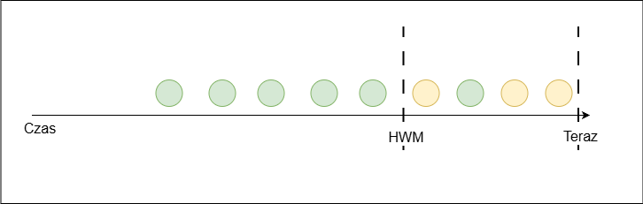
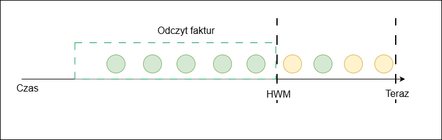

# High Water Mark (HWM)
25.11.2025

Mechanizm High Water Mark (HWM) opisuje, jak KSeF zarządza kompletnością danych w czasie dla daty `PermanentStorage`.

W każdej chwili system zna moment w czasie (`HWM`), do którego ma już pewność, że wszystkie faktury zostały zapisane i nie pojawią się nowe dokumenty z datą `PermanentStorage` wcześniejszą lub równą temu momentowi.

- Dla czasu ≤ `HWM` - wszystkie faktury z datą `PermanentStorage` w tym przedziale zostały już trwale zapisane w KSeF.
System gwarantuje, że w przyszłości nie pojawi się już żadna nowa faktura z datą `PermanentStorage` ≤ `HWM`.
- W przedziale (`HWM`, `Teraz`):
    - część faktur jest już widoczna i może zostać zwrócona w zapytaniu,
    - z uwagi na asynchroniczny i wielowątkowy charakter procesu zapisu, w tym przedziale mogą się jeszcze pojawić nowe faktury, tj. z datą `PermanentStorage` mieszczącą się w zakresie (`HWM`, `Teraz`].

Wniosek:
- wszystko, co ≤ `HWM`, można traktować jako zbiór **zamknięty** i **kompletny**,
- wszystko, co > `HWM`, jest **potencjalnie niepełne** i wymaga ostrożnego traktowania przy synchronizacji.

## Scenariusz 1 - synchronizacja "tylko do HWM"

System przy każdym zapytaniu pobiera faktury **od "ostatniego znanego punktu" tylko do bieżącej wartości `HWM`**. Nowa wartość `HWM` staje się początkiem kolejnego przedziału.

Zalety:
- dane do `HWM` są definitywne - nie trzeba ponownie sprawdzać tego samego przedziału,
- liczba duplikatów między kolejnymi pobraniami jest minimalna.

Konsekwencje:
- część najświeższych faktur z zakresu `(HWM, Teraz]` nie jest widoczna w systemie lokalnym - pojawią się dopiero po przesunięciu `HWM` w kolejnym cyklu.

Scenariusz ten jest rekomendowany dla przyrostowego, automatycznego synchronizowania danych, w których ważniejsza od natychmiastowej dostępności najświeższych faktur jest optymalizacja ruchu i minimalizacja liczby duplikatów.

## Scenariusz 2 - synchronizacja "do Teraz"

System integrujący się z KSeF wykonuje cykliczne, przyrostowe zapytania **od ostatniego punktu startowego aż do `Teraz`** i zapisuje wszystkie zwrócone faktury, również z przedziału `(HWM, Teraz]`.

Ponieważ dane w tym przedziale mogą być niepełne, **kolejne zapytanie powtarza część zakresu** - co najmniej od poprzedniego `HWM` do nowego `Teraz`. Po stronie systemu lokalnego konieczna jest deduplikacja (np. po numerze KSeF).

Zalety:
- lokalny system (i użytkownik) widzi najnowsze faktury możliwie szybko, bez czekania aż `HWM` je "dogoni".

Konsekwencje:
- zakres `(HWM, Teraz]` musi być sprawdzany ponownie przy kolejnym zapytaniu,
- pojawią się duplikaty, które należy usuwać po stronie systemu lokalnego.

Ten sam mechanizm może być wykorzystywany również **ad hoc**, gdy użytkownik ręcznie żąda odświeżenia danych - system pobiera wtedy "tu i teraz" najświeższe dostępne faktury od ostatnio znanej daty aż do `Teraz`.

## Powiązane dokumenty

- [Przyrostowe pobieranie faktur](przyrostowe-pobieranie-faktur.md)
